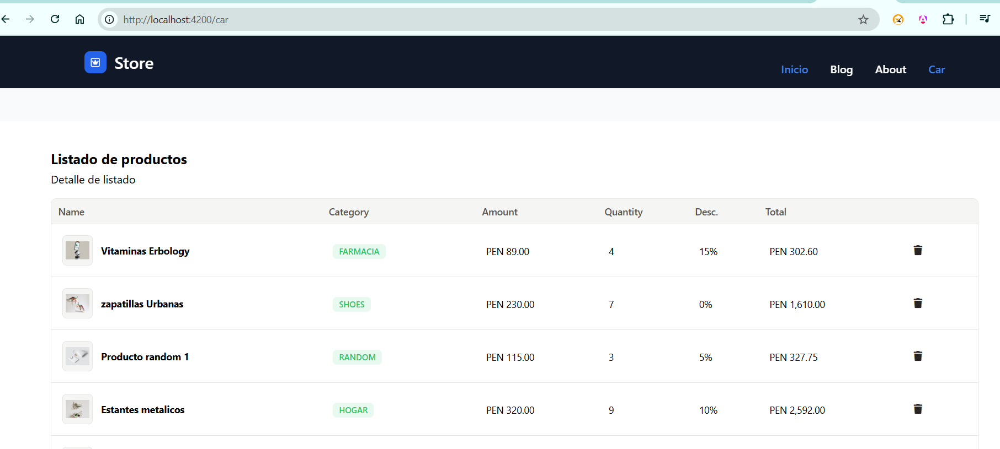

# Laboratorio 02

## Ejecución del laboratorio
Del proyecto de angular
### Agregue la librería de CSS.
Se agrego Tailwind como librería de CSS. Empleandose la versión
1. Se instalo Tailwind CSS.
    ```
    npm install -D tailwindcss@3 postcss autoprefixer
    npx tailwindcss init
    ```
2. Se configuro el archivo `tailwind.config.js`.
    ```
    module.exports = {
      content: [
        "./src/**/*.{html,ts}",
      ],
      theme: {
        extend: {},
      },
      plugins: [],
    }
    ```
3. Se agrego al archivo `style.css` las directivas de `@tailwind`
    ```
    @tailwind base;
    @tailwind components;
    @tailwind utilities;
    ```

### Cree el componente de listado de productos.
1. Se creo el componente listado de productos disponible visualmente en el enlace Car.
2. En el código se hizo la pagina de listado de productos el cual esta disponible en store/pages/car-page 
3. La pagina envia a traves de inputs los productos a un componente `list-product`, para lo cual emplea un servicio. Los datos de servicio estan en duro. 
4. Visualmente se ve asi.



### Utilice las directivas y pipes de Angular, para presentar la tabla de Productos.
1. Para la presentación del listado de productos, se empleo la directiva de estructural `@for` para visualizar el listado y el `@if` si no hay componentes.
  ```
  @for (prod of products(); track $index) {
  <tr>
    <td class="p-4 border-b border-surface-light">
      <div class="flex items-center gap-3">
        
        <small class="font-sans antialiased text-sm text-current font-bold">{{ prod.name }}</small>
      </div>
    </td>
    <td class="p-4 border-b border-surface-light">
      <div class="w-max">
        <div class="relative inline-flex w-max items-center border font-sans font-medium rounded-md text-xs p-0.5 bg-green-500/10 border-transparent text-green-500 shadow-none">
          <span class="font-sans text-current leading-none my-0.5 mx-1.5">{{ prod.category | uppercase }}</span>
        </div>
      </div>
    </td>
    <td class="p-4 border-b border-surface-light">
      <small class="font-sans antialiased text-sm text-current">{{ prod.price | currency:'PEN ' : 'symbol' :'1.2-2' }}</small>
    </td>
    <td class="p-4 border-b border-surface-light">
      <small class="font-sans antialiased text-sm text-current">{{ prod.quantity }}</small>
    </td>
    <td class="p-4 border-b border-surface-light">
      <small class="font-sans antialiased text-sm text-current">{{ prod.discount | percent }}</small>
    </td>
    <td class="p-4 border-b border-surface-light">
      <small class="font-sans antialiased text-sm text-current">{{ (prod.price * prod.quantity)*(1- prod.discount)| currency:'PEN ' : 'symbol' :'1.2-2' }}</small>
    </td>
    <td class="p-4 border-b border-surface-light">
      <button class="inline-grid place-items-center border align-middle select-none font-sans font-medium text-center transition-all duration-300 ease-in disabled:opacity-50 disabled:shadow-none disabled:pointer-events-none text-sm min-w-[38px] min-h-[38px] rounded-md bg-transparent border-transparent text-stone-800 hover:bg-stone-200/10 hover:border-stone-600/10 shadow-none hover:shadow-none outline-none group">
        <i class="fa-solid fa-trash"></i>
      </button>
    </td>
  </tr>
  }
  @if( products().length == 0 ) {
  <tr>
    <td class="p-4 border-b border-surface-light" colspan="6">
      sin productos
    </td>
  </tr>
  }
  ```
2. Para la presentación del monto y descuento se empleo pipes, uno de ellos el currency y uno generado
  ```
  <small class="font-sans antialiased text-sm text-current">{{ prod.price | currency:'PEN ' : 'symbol' :'1.2-2' }}</small>
  <small class="font-sans antialiased text-sm text-current">{{ prod.discount | percent }}</small>
  ```

 