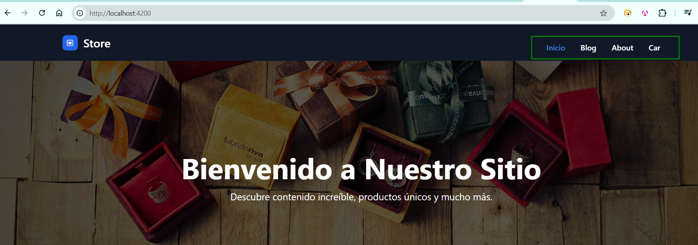

# Laboratorio 03

## Ejecución del laboratorio
### 1. Cree los componentes respectivos
Se crearon los componentes dentro de la carpeta pages, ya que estos componentes se van a exponer con rutas.
  - `home-page` 
  - `blog-page`
  - `about-page`
  - `car-page` 
### 2. Cree un módulo Routing, por cada módulo
Se creo un routing para cada componente.
  - home-page-routing.module.ts
  - blog-page-routing.module.ts
  - about-page-routing.module.ts 
  - car-page-routing.module.ts  
### 3. Agregue las rutas a la aplicación, tanto para las vistas en el módulo
- Las rutas fueron declaras usadas en `app.routes.ts`
- Las emplee en components/header-menu/header-menu-list
  ```
    menuOptions: MenuOption[] = [
      { label: 'Inicio', route: '/'},
      { label: 'Blog', route: '/blog'},
      { label: 'About', route: '/about'},
      { label: 'Car', route: '/car'}
    ];
  ```
- Se empleo los routerLink para visualizar el enlace y RouterLinkActive para manejar que ruta esta activa. Lo que no logre es que no se activa el Inicio por defecto.
  ```
  @for (item of menuOptions; track item.route) {
  <li>
    <a [routerLink]="item.route" routerLinkActive="md:text-blue-700 md:dark:text-blue-500" class="nav-link block py-2 px-3 text-white bg-blue-700 rounded md:bg-transparent  md:p-0  transition-colors duration-200" data-section="item.label">{{ item.label }}</a>
  </li>
  }
  ```
  
